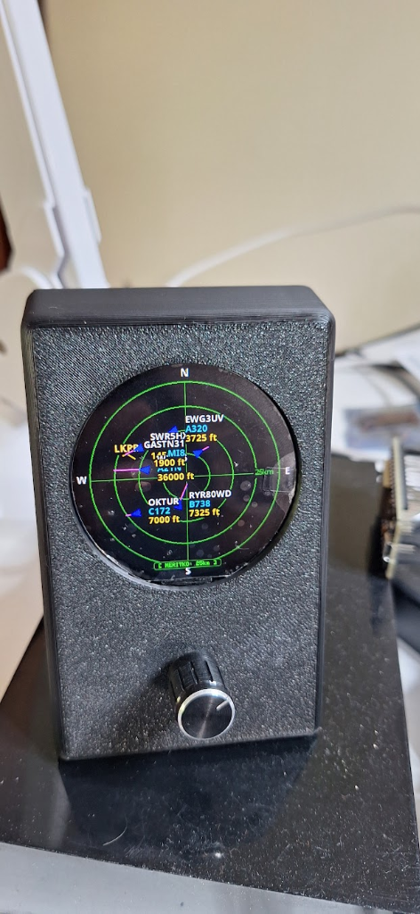

# ESP32 Plane Radar & Aviator Chronometer (2.1" Round Display Edition)

<p align="center">
  
</p>

Live **ADS-B Flight Radar** & **Aviator Chronometer** desktop console running on an **ESP32-C3 Super Mini**, featuring a **2.1″ 360×360 round SPI TFT display (GC9B72)**, an **EC11 rotary encoder**, and a custom **3D-printable 18° tilted desk console enclosure**.

---

## Key Features

- **2.1″ Round 360×360 GC9B72 SPI Display**: High-resolution, vibrant circular display driven by [LovyanGFX](https://github.com/lovyan03/LovyanGFX) for buttery-smooth 40 MHz SPI DMA rendering.
- **Live ADS-B Flight Tracking**: Real-time aircraft tracking from [adsb.fi](https://opendata.adsb.fi/) plotted on a circular aviation sonar grid with altitude, speed vector, callsign, and aircraft type.
- **EC11 Rotary Encoder Navigation**:
  - **Rotate**: Smoothly adjust radar zoom range (5, 10, 15, 25 km) or browse individual aircraft targets.
  - **Click**: Cycle between **Radar Mode**, **Aircraft Details Screen**, and **Aviator Chronometer Clock Mode**.
- **Aviator Chronometer Mode**: Authentic aviation clock face with date window, digital time, second hand, and automatic NTP internet time synchronization (CET/CEST supported).
- **Wi‑Fi Setup & Configuration Portal**: Built-in captive portal (`PlaneRadar-Setup` AP / `http://plane-radar.local`) to configure Wi-Fi, radar center coordinates, units (km / miles), and runway overlays.
- **3D Printable Desktop Enclosure**: Fully parametric OpenSCAD model (`cad/plane_radar_case.scad`) and ready-to-print STL files (`cad/plane_radar_case-front.stl`, `cad/plane_radar_case-back.stl`) optimized for face-down FDM printing without supports.

---

## Hardware & Wiring

### Components

| Component | Description |
|-----------|-------------|
| **Microcontroller** | ESP32-C3 Super Mini |
| **Display** | 2.1″ Round 360×360 TFT LCD (GC9B72 driver, 10-pin SPI) |
| **Controls** | EC11 Rotary Encoder with push button (e.g. KY-040 module) |
| **Enclosure** | 3D-printed case (OpenSCAD / STL included in `cad/`) |

### Pinout Mapping (ESP32-C3 Super Mini)

#### Display (GC9B72 2.1" Round 10-Pin SPI)
| Display Pin | ESP32-C3 GPIO | Notes |
|-------------|---------------|-------|
| **VCC / VDD** | **3V3** | 3.3V Power |
| **GND** | **GND** | Ground |
| **SCL (SCLK)** | **GPIO 4** | SPI Clock |
| **SDA (MOSI)** | **GPIO 3** | SPI Data |
| **RST (RES)** | **GPIO 0** | Display Reset |
| **DC** | **GPIO 10** | Data / Command |
| **CS** | **GPIO 1** | Chip Select |
| **BL (LEDA)** | **3V3** (or NC) | Backlight Power |

#### Rotary Encoder (EC11)
| Encoder Pin | ESP32-C3 GPIO | Notes |
|-------------|---------------|-------|
| **CLK (A)** | **GPIO 5** | Quadrature Channel A |
| **DT (B)** | **GPIO 6** | Quadrature Channel B |
| **SW (Button)**| **GPIO 7** | Push Button (Active LOW) |
| **GND** | **GPIO 8** | Virtual GND (driven LOW by firmware) |
| **+ (VCC)** | **GPIO 2** | Virtual 3.3V VCC (driven HIGH by firmware) |

#### System Controls
| Control | ESP32-C3 GPIO | Action |
|---------|---------------|--------|
| **BOOT Button** | **GPIO 9** | Hold 3 s to reset Wi-Fi credentials & launch setup portal |

---

## Controls & Operating Modes

| Control | Action | Effect |
|---------|--------|--------|
| **Rotary Knob** | **Turn** | Adjust radar range (5 ↔ 10 ↔ 15 ↔ 25 km) or browse aircraft |
| **Rotary Knob** | **Click** | Switch display mode: **Radar** $\rightarrow$ **Aircraft Details** $\rightarrow$ **Chronometer** |
| **BOOT (GPIO 9)** | **Hold 3 s** | Reset Wi-Fi configuration and reboot into captive setup portal |

---

## Wi‑Fi Setup Portal

1. On first boot (or after holding BOOT for 3 s), connect your phone or PC to the Wi-Fi network **`PlaneRadar-Setup`**.
2. A captive portal should automatically open. If not, browse to **`http://plane-radar.local`** or **`http://192.168.4.1`**.
3. Select your home Wi-Fi network, enter the password, and configure:
   - **Latitude / Longitude**: Your home radar center coordinates.
   - **Units**: Distances in kilometers (`km`) or miles (`mi`).
   - **Runways Overlay**: Toggle major airport runway strips on/off.
4. Save and restart. The radar will automatically connect and begin tracking flights.

---

## 3D Printed Console Case

The repository includes a custom parametric console enclosure in the `cad/` directory:

- **`cad/plane_radar_case.scad`**: Parametric OpenSCAD source file.
  - Supports `part = "front"`, `part = "back"`, and `part = "test_bezel"`.
- **`cad/plane_radar_case-front.stl`**: Main console body with 18° front tilt, internal 2.0mm display collar, locating pin studs, snap-fit tabs, and sliding rails for ESP32-C3. Designed to print face-down on a textured PEI plate without supports.
- **`cad/plane_radar_case-back.stl`**: Recessed rear cover plate with ventilation louvers, USB-C cutout, and countersunk M2.5/M3 screw holes.

---

## Building and Flashing

### PlatformIO

```bash
# Build and upload firmware to ESP32-C3 Super Mini
pio run -e supermini -t upload

# Open serial monitor (115200 baud)
pio device monitor
```

---

## Credits & Acknowledgments

- Based on the original [ESP32-Plane-Radar](https://github.com/MatixYo/ESP32-Plane-Radar) by [MatixYo](https://github.com/MatixYo).
- Flight data provided by [adsb.fi](https://opendata.adsb.fi/).
- Graphics engine powered by [LovyanGFX](https://github.com/lovyan03/LovyanGFX).
- Airport database sourced from [OurAirports](https://ourairports.com/).
